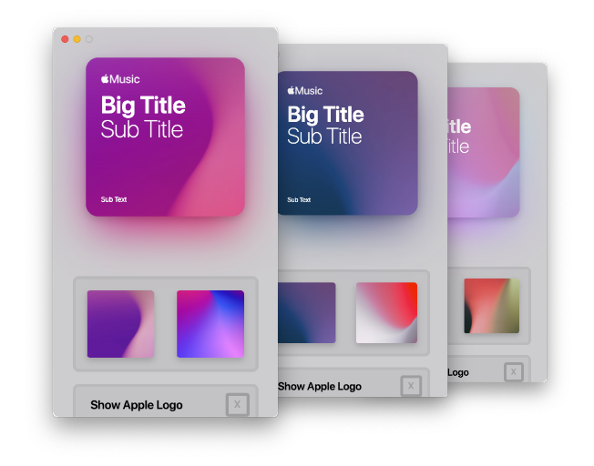

# Album Art Creator

Create amazing looking Album Art in seconds!

Originally made by [0neGuyDev](https://github.com/0neGuyDev), converted to the web by [planecore](https://github.com/planecore).

---

### What is this?

Album Art Creator is an app that takes your input and sends out an output album art which looks stunning. The designs very obviously resemble Apple's own album art used for the "For You" playlist's which they make.

### How to use?

Go to the [website](https://planecore.github.com/AppleMusicCoverArt).

**Where's the Windows release?**

I don't have a Windows machine currently, some releases may not yet have a Windows build. If there's a current release that doesn't have a build I'd love it if you could compile it for me and send it to me!

### My Album Art doesn't show up for other people

This is a very common issue, the reason this happens is also very simple, Apple doesn't want users to act as if they made "Official Playlists" and so playlist's with Apple's logos in them won't show up on other people's devices, this is why there's a toggle for it.

### What is the future of AAC?

I don't have much planned other than a few small features and probably some bug fixes once they get found. As mentioned above there's the web repository but outside of that there're no plans.

### Oi, I FOUND A BUG!

That's cool, very cool! However it shouldn't be there! Be sure to report a detailed report on the [issues page](https://github.com/0neGuyDev/albumArtCreator/issues), I haven't set up a template yet so just try to be descriptive, say how it is produced etc etc...
